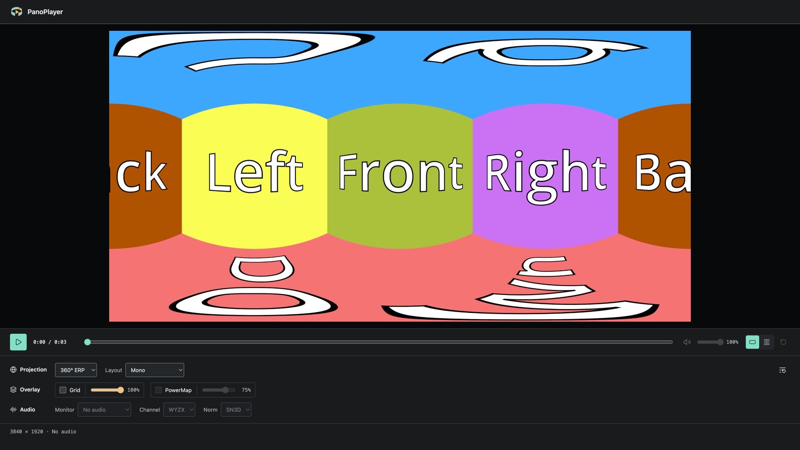
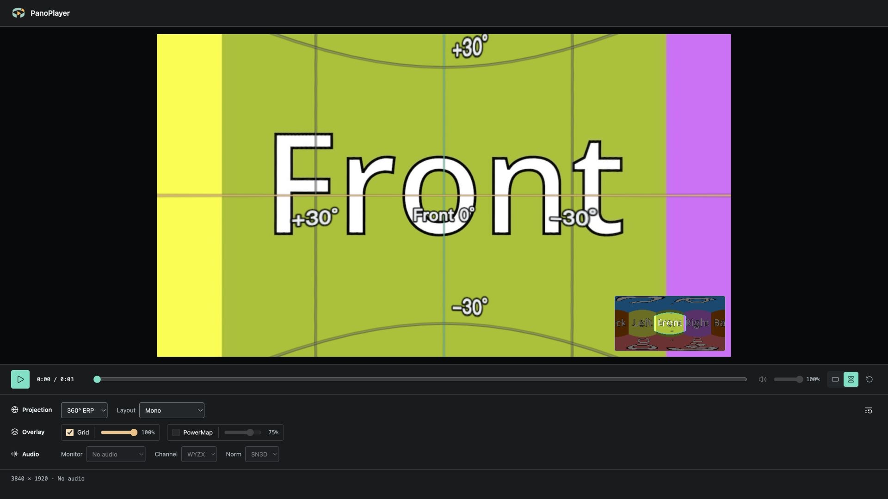
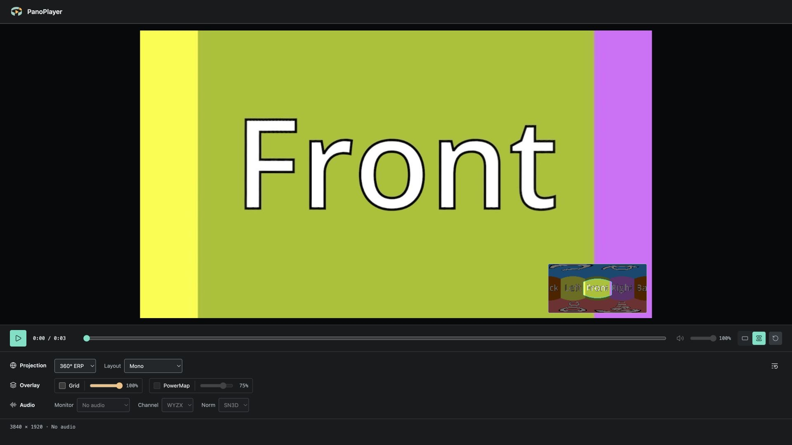
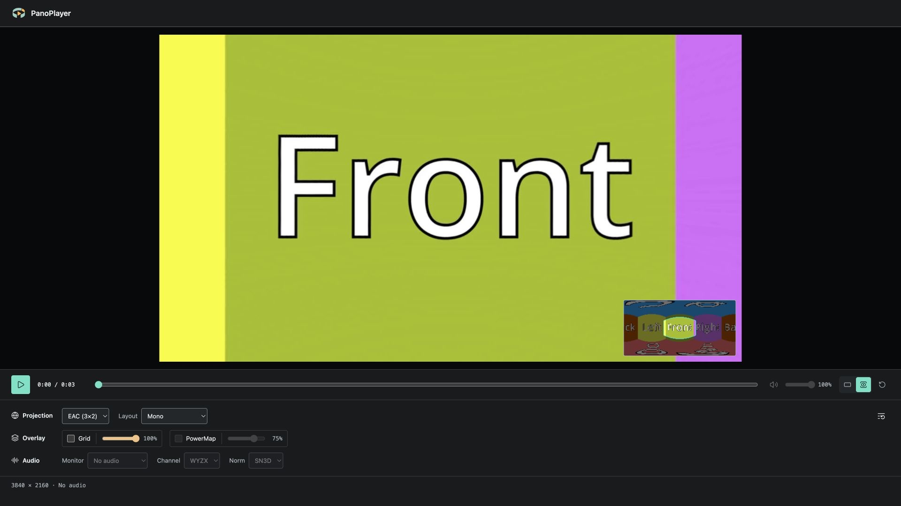
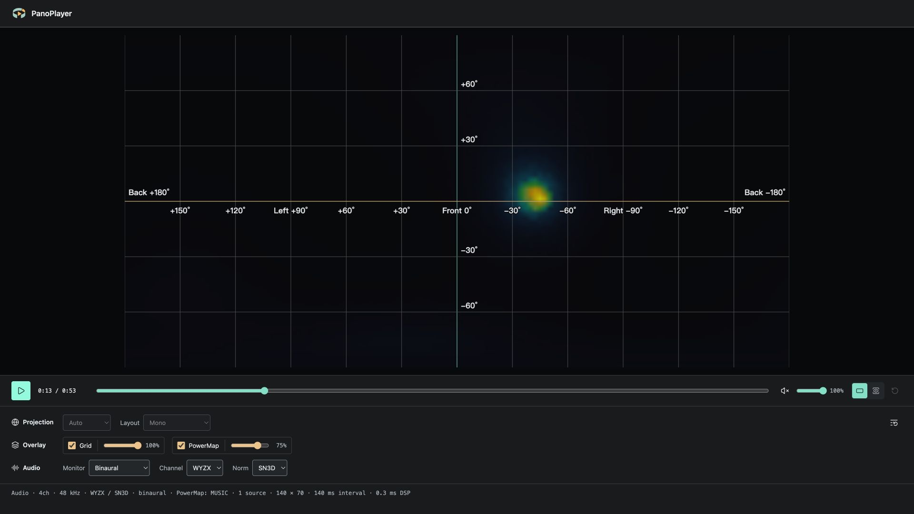

<p align="center">
  
</p>

# PanoPlayer

[](https://marketplace.visualstudio.com/items?itemName=shijunjie.pano-player)
[](https://marketplace.visualstudio.com/items?itemName=shijunjie.pano-player)
[](docs/REFERENCE.md)
[](LICENSE)

**Explore panoramic video, listen to spatial audio, and see sound directions live in VS Code.**

Review 180° and 360° video with four-channel first-order Ambisonics (FOA), camera-relative binaural audio, and live PowerMap overlays. Standard mono and stereo media play without spatial processing, locally or through Remote SSH and Cloud IDE.

[Get PanoPlayer](https://marketplace.visualstudio.com/items?itemName=shijunjie.pano-player) · [Technical reference](docs/REFERENCE.md) · [Report an issue](https://github.com/jinnsjj/pano-player/issues)



*Panorama shows the full ERP reference image. View tabs sit in the transport bar; Projection, Overlay, and Audio settings are grouped below it. This silent example has audio and PowerMap controls disabled.*

## Explore The Scene

- **Panorama**: see the unfolded scene and sound directions together.
- **Perspective**: drag to look around, scroll to change the field of view, and reset to face forward.
- **PanoView**: a movable panorama overview with the current field of view, toggled from the Overlay row.
- **Overlay grid**: optional 30-degree azimuth/elevation lines with front, left, right and back labels, in both views. Grid and PowerMap have independent toggles, with opacity in collapsible settings menus; Grid is available even without audio.
- **Playback controls**: switch view tabs, reset the camera, seek, adjust volume, and mute without reopening the file.



*Perspective reconstructs the forward-facing view, with an optional direction grid. The panorama thumbnail marks the current field of view.*

## See And Hear Sound Directions

**Live PowerMap** estimates sound directions from four-channel FOA audio during playback. Its settings menu offers **PWD / MUSIC**, **1 / 2 sources** for MUSIC, and opacity. Defaults are MUSIC with one source.

**Binaural monitoring** uses Omnitone to render FOA for headphones. Turning the Perspective camera changes your listening direction. **Stereo Monitor** keeps the mix aligned to the recording axes.

Choose **WYZX / WXYZ** channel order and **SN3D / N3D** normalization independently, without reopening the file.

> Four channels do not automatically mean FOA. Spatial processing expects first-order Ambisonics, not ordinary quadraphonic speaker audio. PowerMap is for qualitative direction review; the MUSIC source count is an assumption, not automatic detection. It is not a calibrated sound-pressure measurement or source-separation tool.

## 180°, 360°, And EAC

| Source | Playback |
| --- | --- |
| Auto (default) | Infer 180° ERP for a near-square single-eye image; otherwise use 360° ERP |
| 360° ERP | Panorama or Perspective view, including frames that are not exactly 2:1; the overlay stretches to match the image |
| 180° ERP | Placed in the front half of a full 360° coordinate domain, with a blank rear hemisphere to avoid horizontally compressing the direction map |
| EAC (3×2) | Real-time projection conversion for the supported cube-face layout, without transcoding the whole video first |
| Mono / Stereo SBS / Stereo TB | Mono plays directly; side-by-side uses the left eye, and top-bottom uses the top eye |

Auto reevaluates each video, rotation and stereo layout. It is a heuristic, not projection detection: choose EAC or override ERP when needed. Stereo support means **single-eye playback**, not stereoscopic output to a VR headset.

**Rotation** corrects the source image clockwise by **0°, 90°, 180° or 270°** before stereo cropping and projection. Panorama, Perspective and the overview use the same corrected image; audio and direction overlays stay in their original coordinate system.

### Projection Examples

ERP and EAC store the surrounding scene in different layouts. Select the matching
projection to reconstruct the viewing direction, rather than stretching the source
image into a flat camera view.

| 360° ERP source | EAC (3×2) source |
| --- | --- |
|  |  |
| Longitude and latitude unfold into one panorama, with stretching near the poles. | Six cube faces are packed into two rows; face position and rotation matter. |

With **Layout: Mono**, **Perspective**, and the same forward-facing camera:

| Projection: 360° ERP | Projection: EAC (3×2) |
| --- | --- |
|  |  |

Both show **Front** upright and centered, with **Left** and **Right** at the sides.
The overview shows the unfolded panorama and current field of view. EAC must be
selected manually; Auto only infers 180° or 360° ERP.

These are actual player captures. The supplied reference images were encoded as
short silent videos for playback, so audio controls are disabled. This comparison
demonstrates projection rendering, not differences in codec quality or direct JPEG support.

## Keep Your Settings

Projection, layout, rotation, view, camera direction, audio, volume, mute, overlay toggles and opacities, PowerMap algorithm and MUSIC source count carry over between files and restarts. Use **Restore default settings** to reset them without interrupting playback. Playback position is not carried over; local and remote extension hosts keep separate preferences.

## Spatial Audio Without Video

Play FOA WAV and FLAC files with a standalone full-sphere PowerMap, channel-order and normalization settings, and binaural monitoring. No placeholder video is needed.



*A live direction map from four-channel WAV. Mono and stereo audio automatically use Bypass, without FOA analysis or binaural rendering.*

Mono and stereo video retain Panorama and Perspective viewing. Audio passes through with its decoded channels preserved, with volume and mute controls.

Videos without an audio track also play in both views, with seeking and replay. Audio and PowerMap controls are disabled without changing your saved audio preferences.

## Streaming And Remote Media

- **Four-channel MP4 + AAC and WebM + Opus** use bundled WASM audio decoders. Playback decodes as data arrives rather than waiting for a whole-file transcode.
- **MP4, WebM, MOV, MKV, WAV and FLAC** are available in Open With. Playback depends on the codecs inside each file.
- **FLAC** uses incremental decoding through the host browser's WebCodecs FLAC decoder, preserving 1, 2 or 4 source channels without a whole-file conversion.
- **Local, Remote SSH, and Cloud IDE** media are read from the workspace host, without manually downloading the entire file first.
- **No extra decoder setup**: no user-installed FFmpeg, FFprobe, Python, server, or port forwarding.
- **Source files stay unchanged**, and media is not uploaded to third-party processing services.

Video decoding depends on the host browser's WebCodecs support. Perspective view, EAC, rotation and single-eye cropping require WebGL2. When audio is present, the player supports 1, 2, or 4 channels and uses the primary audio track. Other channel counts, track selection, FuMa normalization, and arbitrary cube-face layouts are not supported.

## Open Your Media

Choose **Open With > PanoPlayer** on a media file, or run **PanoPlayer: Open Media**.

### Make PanoPlayer The Default

Run **Preferences: Open User Settings (JSON)** from the Command Palette and add
these entries to `workbench.editorAssociations`:

```json
{
  "workbench.editorAssociations": {
    "*.mp4": "panoPlayer.player",
    "*.webm": "panoPlayer.player"
  }
}
```

Merge the entries into your existing settings rather than replacing the file.
MP4 and WebM files will then open with PanoPlayer by default. Add `*.mov`, `*.mkv`
`*.wav` or `*.flac` with the same value to include those formats. To limit the association
to one project, put the entries in that workspace's `.vscode/settings.json` instead.
Remove the entries to return to VS Code's default behavior.

Requires VS Code 1.84+ and a Node extension host with access to workspace files. Cloud IDE must allow Webviews, Workers, WebAssembly, and Web Audio. Browser-only vscode.dev without a remote extension host is not supported.

Screenshots show PanoPlayer 0.4.17 running in a local browser test host, captured on
2026-09-21, not mockups. They do not imply validation on every Cloud IDE or platform.

For installation and development, see the [technical reference](docs/REFERENCE.md). See [third-party notices](THIRD_PARTY_NOTICES.md) for component licenses.
